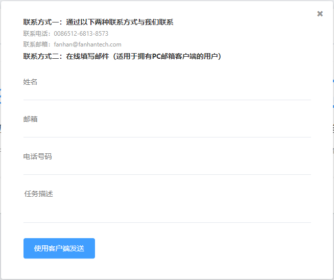
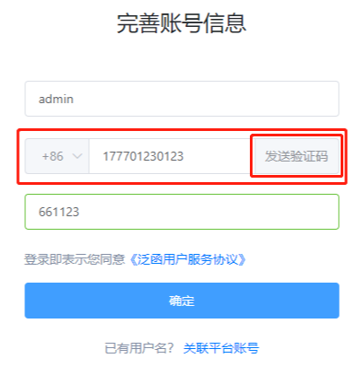

# 标注平台组件

### 公共组件
### 私有组件

1. 发送邮件组件（sendmail.vue）

    
    
    父组件引入：
    
    HTML：
    
    ```
    <sendmail @hidePanel = "hidePanel" :speakeStatus="speakeStatus"/>
    ```
    
    @hidePanel：子组件隐藏事件，绑定在叉号上
    
    :speakeStatus：子组件显示状态（默认为隐藏状态，值为布尔类型）
    
    事件：
    
    ```
    hidePanel () {
    	this.speakeStatus = false
    }
    ```
2. 发送验证码（PIN.vue）

    
    
    父组件引入:
    
    ```
    <ButtonPIN ref="sendSms" action="/api/account/smsverificationcode" @click.native="sendCode('form')" slot="append"/>
    ```
    
    ```
    import ButtonPIN from 'components/private/PIN'
    ```
    
    ```
    components: {
       ButtonPIN
    },
    ```

    | 属性          | 作用                                                   |
    | ------------- | ------------------------------------------------------ |
    | action        | 绑定API                                                |
    | ref           | 类似与id  父组件通过它操作子组件中的数据和函数         |
    | @click.native | 子组件绑定点击事件的写法，其使用的函数写在父组件内     |
    | slot="append" | 饿了么组件复合型输入框必须属性，如果为单独按钮，可忽略 |
    
    | 数据及函数       | 作用               | 要求     |
    | ---------------- | ------------------ | -------- |
    | sendSmsPost()    | 发送验证请求的函数 | 必须执行 |
    | postData         | 传递数据，格式json | 必须填写 |
    | sendCodeDisabled | 按钮是否禁用       |          |

    注：父组件中使用数据和函数必须遵循格式
    如子组件的ref为sendSms，使用sendSmsPost()
    
    ```
    this.$refs.sendSms.sendSmsPost()
    ```

   ​